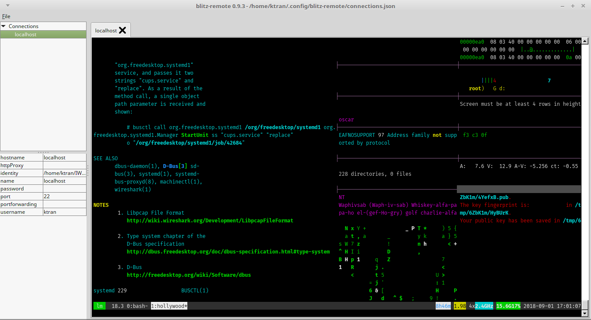

# blitz-remote

The main purpose of this project is to provide a simple application to manage multiple SSH sessions.
This project is mainly based on [JediTerm](https://github.com/JetBrains/jediterm) and 
[JSCH](http://www.jcraft.com/jsch/) for the terminal emulation.

Somewhat inspired by [mRemoteNG](https://github.com/mRemoteNG/mRemoteNG) (only for Windows).

## Main features
 * Tab based SSH-Terminals
 * Tree-like structure to organize your connections
 * Port forwarding to local ports
 * Identity files (*.pem) for key based authentication
 * Uses ~/.ssh/known_hosts and ~/.ssh/id_rsa as identity.
 

## Run

Grab a release from the releases page. The .zip release has a start script in the bin folder.

Or run the standalone .jar with

`java -jar blitz-remote-x.x.x.jar`

## Build

Gradle is used to build this project.

`./gradlew build`